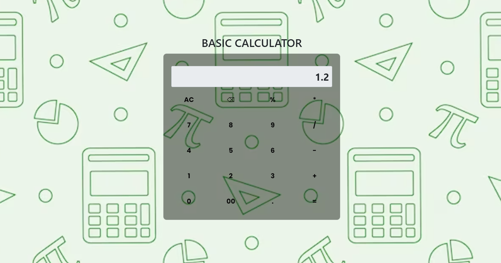

# Basic Calculator

A simple, interactive web-based calculator built with HTML, CSS, and JavaScript to perform basic arithmetic operations.

## Features

- Basic arithmetic operations: addition, subtraction, multiplication, and division.
- Clear and backspace functions for input correction.
- Responsive design for various screen sizes.

## Technologies Used

- HTML
- CSS
- JavaScript
- Bootstrap 5
- Google Fonts

## How to Use

1. Open the `index.html` file in your browser.
2. Click the calculator buttons to perform calculations.
3. Use the `AC` button to clear the input and the `⌫` button to delete the last character.

## Files

- `index.html`: The main HTML file.
- `style.css`: The CSS file for styling.
- `script.js`: The JavaScript file for calculator functionality.
---
## Conclusion

The Basic Calculator is a practical example of a web application that integrates HTML, CSS, and JavaScript to provide an interactive user experience. This calculator can be easily extended with additional features or adapted to different design requirements.

feel free to reach me at rajkumaranbu192@gmail.com.

